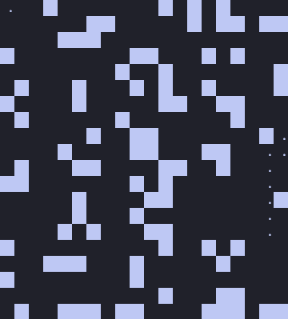
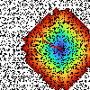

# Path Finder 3000

This project implements Breadth-First Search (BFS) pathfinding on both CPU and GPU (CUDA) to compare performance. It generates procedural maps using Cellular Noise via `FastNoiseLiteCUDA` and attempts to find a path between two random points.

## Requirements

*   C++ Compiler
*   CMake
*   NVIDIA GPU with CUDA Toolkit installed

## Building

You can build the project using CMake. 

```bash
cmake -B build_Release -DCMAKE_BUILD_TYPE=Release -DCMAKE_EXPORT_COMPILE_COMMANDS=ON
cmake --build build_Release
```

## Usage

The program accepts command-line arguments to set the mode or handle map files.

### Flags

*   `--mode [cpu|gpu]`: Sets the execution mode.
*   `--create [filename]`: Generates a map and saves it to a file without running pathfinding.
*   `--load [filename]`: Loads a map from a file instead of generating a new one.

### Interactive Settings

If you run the executable, it will ask for the following parameters at runtime:

1.  **Square size**: The width/height of the square grid.
2.  **Threshold (0-1)**: Determines wall density based on the noise map.
3.  **Seed**: Seed for the random generation.
4.  **Reconstruction algorithm** (GPU mode only): Choose whether to reconstruct the path vector on the CPU or GPU after the wave expansion.

### Example Run

```bash
./build_Release/path_finder --mode gpu
```

## Visuals

Here are some visualizations of the propagation waves generated by the algorithm.






## Notes

*   **CPU Path Reconstruction**: Currently, the CPU implementation performs the BFS wave expansion but returns an empty path array. This is intentional for benchmarking the calculation phase without the overhead of backtracking.
*   **Terminal Output**: The console map visualization (`print_mat_path`) is commented out in `main.cpp` to prevent terminal flooding on large map sizes. Uncomment the printing loop in `main` if you want to see the ASCII result.
*   **Dependencies**: The noise generation library is included in the project structure via CMake.
